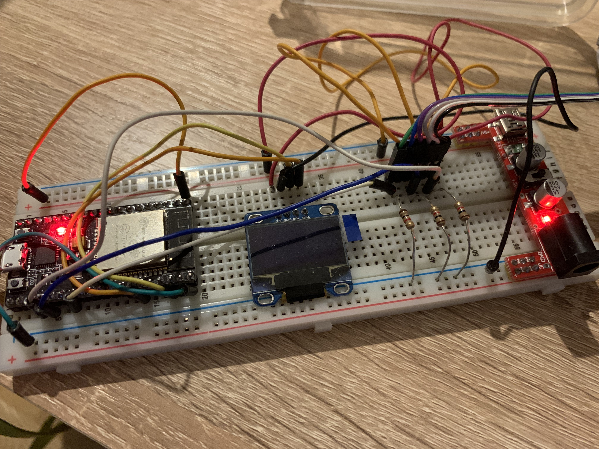

# Axe Fx III Bluetooth Foot Switch

Disclaimer: this project has absolutely no affiliation with Fractal Audio Systems. It's just an implementation based on their public document [AXE-FX III MIDI FOR THIRD-PARTY DEVICES](http://www.fractalaudio.com/downloads/misc/Axe-Fx%20III%20MIDI%20for%203rd%20Party%20Devices.pdf).

## Current status

This project is in a very early stage of development, for now it requires MIDI CC to be configured in the Axe-Fx, using the following commands:
- Previous Scene = CC # 33
- Next Scene = CC # 35
- Previous Preset = CC # 30
- Next Scene = CC # 31

Soon this configuration won't be necessary when the project starts using the SysEx commands.


- Leftmost button:
    - press: previous scene
    - long-press: previous preset
- Center button:
    - long-press: toggle tuner
- Rightmost button:
    - press: next scene
    - long-press: next preset

In the next versions there will be different assignments and multiple "screens", but for that the OLEDs must work and fetching the Scene/Preset names should be implemented (currently I am having trouble fetching them)

## Requirements

Version 0.1:
- Yamaha MDBT01 Bluetooth MIDI Adapter ([https://www.amazon.de/-/en/gp/product/B01AXSYSLU])
- At least three momentary switches ([https://www.amazon.de/gp/product/B073S4YVF4/])
- ESP32 ([https://www.amazon.de/AZDelivery-ESP32-Development-Successor-Compatible/dp/B074RGW2VQ])
- 3 resistors (1kΩ)
- wiring
- some chassis (I'm using a coffee can, not stable, but enough for prototyping)

Version 0.2 (work-in-progress)
- 4 OLED displays ([https://www.amazon.de/AZDelivery-OLED-Parent-Pixel-Inches/dp/B074NJMPYJ])
- I2C multiplexer ([https://www.amazon.de/-/en/gp/product/B017C09ETS])

## Wiring

I have no idea how to properly document my wiring, I'll post a picture and try to explain the idea, if you have questions please feel free to reach me out.



For now I'm not using the OLED display yet, but it's already connected. For v0.1 to work, all you need is to connect the 3 foot switches to the ESP32 using a pull-down resistor to the ground:

```
                                               ┌────────────┐
                                            ┌──┴──┐         │
                       ┌────────────────────│GPIO │         │
┌──────────────┐       │                    └──┬──┘         │
│             ┌┴────┐  │  ┌────────────┐    ┌──┴──┐         │
│             │Pin 1│──┴──│1kΩ resistor│────│ Gnd │ESP32    │
│  Momentary  └┬────┘     └────────────┘    └──┬──┘         │
│ Foot Switch ┌┴────┐                       ┌──┴──┐         │
│             │Pin 2│───────────────────────│ Vcc │         │
│             └┬────┘                       └──┬──┘         │
└──────────────┘                               └────────────┘
```

The GPIOs used by default are:
```cpp
OneButton previousButton(2, false);
OneButton selectButton(15, false);
OneButton nextButton(4, false);
```

## Call for contribution

Contribution to this project is more than welcome.

## License

MIT